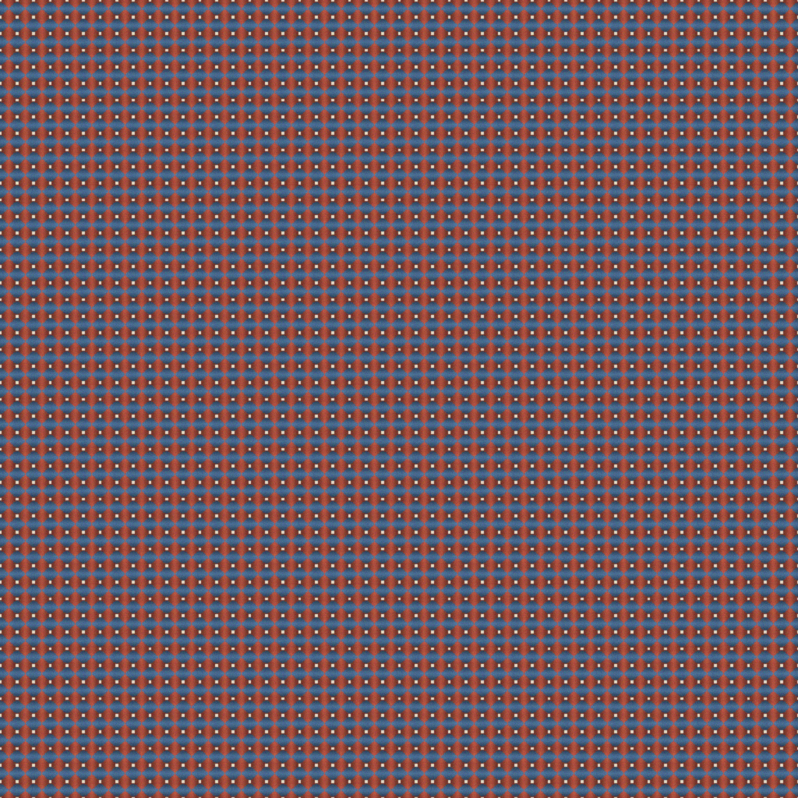

# 🧵 Algorithmic Textile Pattern Generator

A Python-based procedural art tool that generates **fabric-like geometric weaving patterns** — inspired by textile design and algorithmic aesthetics.

<p align="center">
  
</p>

---

## ✨ Features
- Generates **woven fabric textures** using mathematical interlacing.  
- **Seamless tiles** that can be repeated infinitely.  
- Adjustable thread count, warp distortion, and color palettes.  
- Produces both single-tile and multi-tile preview images.  

---

## 🛠 Installation

Make sure you have Python ≥ 3.8 installed, then run:

```bash
pip install pillow numpy
```

## 🚀 Usage

Clone or download the script, then run:

```bash
python textile_generator.py
```

This will generate two images in your working directory:

```textile_tile.png``` — single seamless pattern tile

```textile_preview.png``` — 4×4 tiled preview (as shown below)

## ⚙️ Parameters

You can tweak these variables in ```textile_generator.py``` to customize the look:

| Parameter     | Description                    | Default |
|----------------|--------------------------------|----------|
| `THREADS`      | Number of warp/weft threads     | `12` |
| `THREAD_WIDTH` | Thickness of each thread        | `18` |
| `WARP_FREQ`    | Frequency of warp distortion    | `3.5` |
| `WARP_AMP`     | Amplitude of warp distortion    | `6.0` |
| `PALETTE`      | Color scheme (RGB tuples)       | `[(230,220,200), (180,80,60), (70,110,150), (150,170,100)]` |
