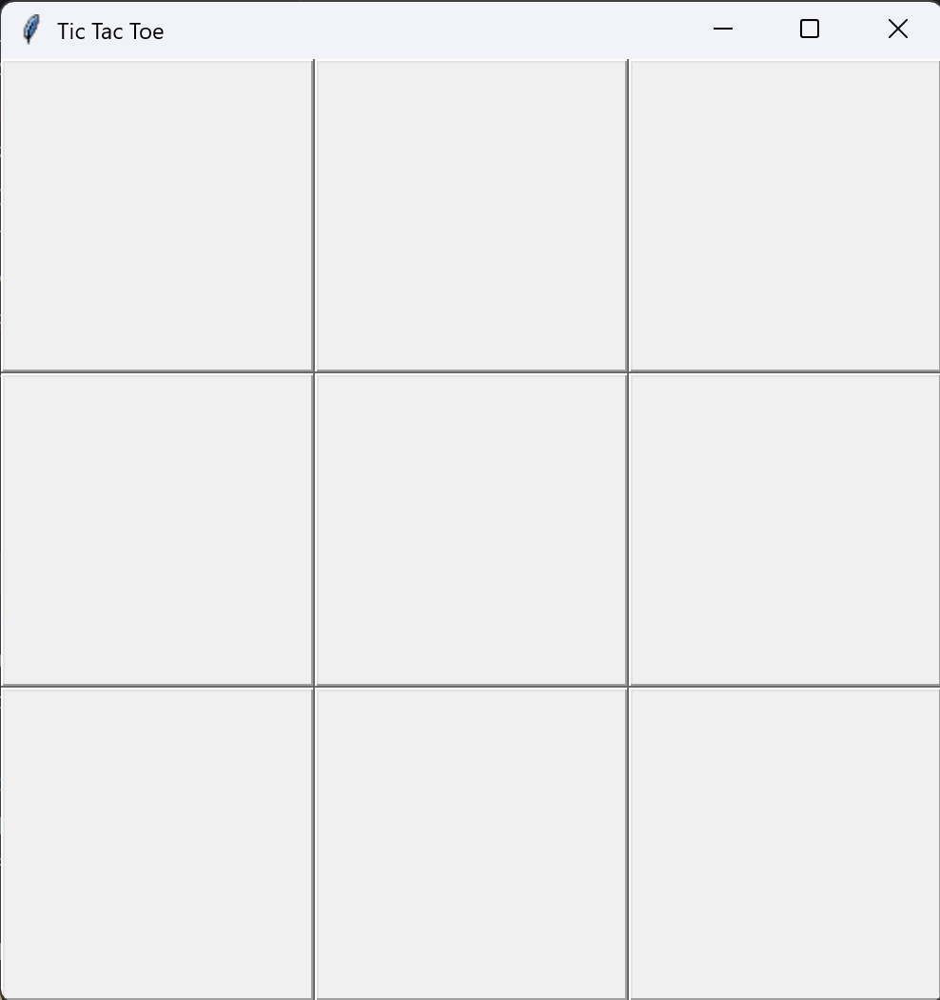
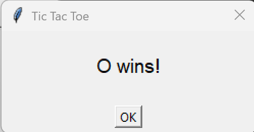

# Tic-Tac-Toe with AI (Minimax Algorithm)

A simple **Tic-Tac-Toe game** built with **Python** and **Tkinter** where you can play against an AI that **blocks and wins optimally** using the **Minimax algorithm**. The game opens in a GUI window and features a silent end-game popup.

---

## Features

- **Graphical Interface** using Tkinter
- **Player vs AI** gameplay
- **AI powered by Minimax algorithm**
  - Blocks your winning moves
  - Wins if possible
- **Silent game-over popup** (no system alert sound)
- Detects **tie games**

---

## Screenshots

**Game Window:**  


**End Game Popup:** 
 

---

## How to Run
- Clone the repository or download the `.py` file.
- Run the game:

```
python tic_tac_toe.py
