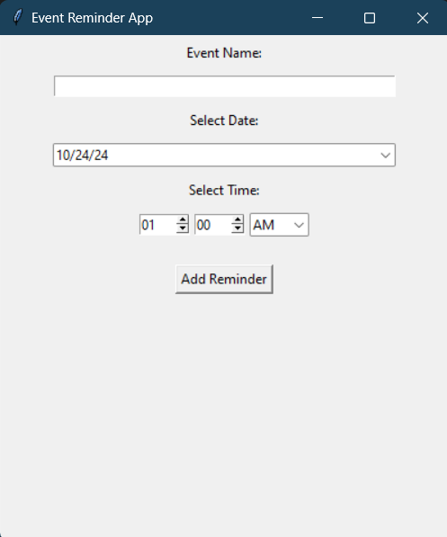

# Event Reminder App

A simple event reminder application built using Python's Tkinter library. The application allows users to input event details, including the event name, date, and time. It will notify users when the event is due.

## Features

- Input event name
- Select event date using a calendar
- Select event time using spin boxes for hours and minutes
- AM/PM selection
- Add reminders and receive notifications at the scheduled time

## Requirements

To run the Event Reminder App, make sure you have the following libraries installed:

- `tkinter`
- `tkcalendar`
- `plyer`

You can install `tkcalendar` and `plyer` using pip:

```bash
pip install tkcalendar plyer
```

## How to Run

1. Clone the repository or download the files.
2. Navigate to the project directory.
3. Run the application by executing the following command:

```bash
python app.py
```

## Usage

1. Enter the name of the event in the "Event Name" input field.
2. Select the event date using the calendar widget.
3. Choose the event time using the hour and minute spin boxes, as well as the AM/PM selector.
4. Click the "Add Reminder" button to set your event.
5. You will receive a notification when it's time for the event.

## Example

When an event is added, a reminder notification will show up as follows:

```
Title: Event Reminder
Message: It's time for: [Event Name]
```

## Contributing

Contributions are welcome! If you have suggestions or improvements, feel free to open an issue or submit a pull request.

## Screen Shots


