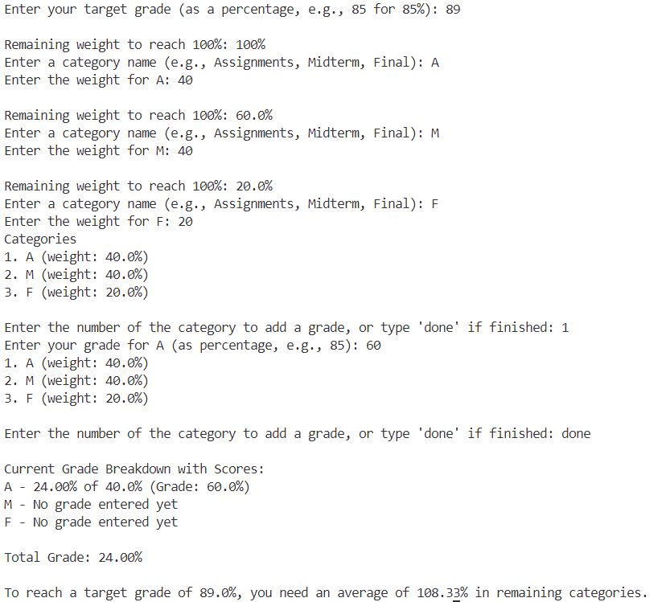

# GradeTracker

GradeTracker is designed to help keep track of their grades in different categories (e.g., assignments, midterms, final exams) and understand what scores they need in remaining categories to reach a target grade. 

## Features

- **Add Grade Categories**: Define different categories (e.g., Assignments, Midterm, Final) with weights that sum up to 100%.
- **Input Grades**: Select categories and input grades for each category based on actual performance.
- **Current Grade Calculation**: View the current total grade based on entered grades and weights.
- **Required Grade Calculation**: Calculate the average grade needed in remaining categories to reach a specified target grade.

## How It Works

1. **Define Target Grade**: Set a target grade percentage (e.g., 90%) that you want to achieve.
2. **Add Categories**: Define grade categories and weights, ensuring the weights add up to 100%.
3. **Add Grades**: Input your grades or predicted grades by category.
4. **View Progress**: View your weighted grade total and see the grades needed in remaining categories to reach your target.

## Installation
Clone the repository or copy the code into a `.py` file on your local machine.

## Usage

Run the program from the command line:

```bash
python gradetracker.py


