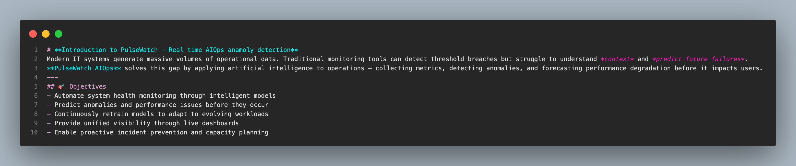
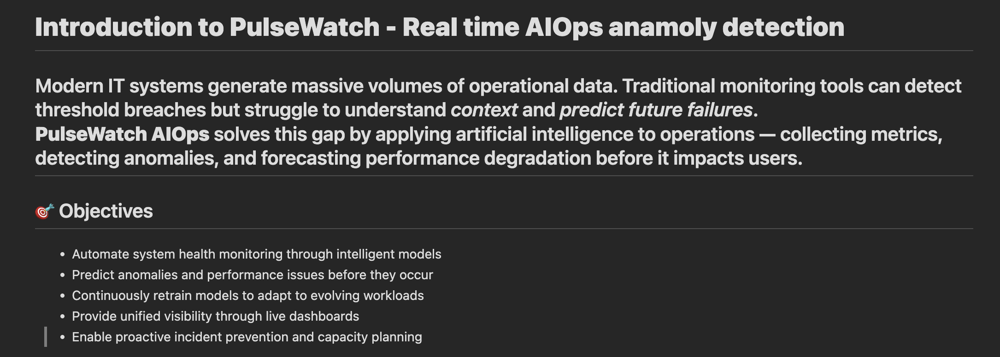

# Markdown To HTML Converter

This python file `md_to_html.py` converts and markdown to HTML. It can handle Headings, Bold text, Italics, Ordered lists, Unordered lists, etc.

### Steps

1. Put your required Markdown text in `input.md`





2. Run the python script 

```
python md_to_html.py
```

3. Observe your results in `output.html`

