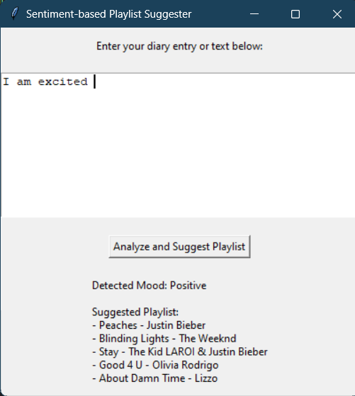

# Sentiment-based Playlist Suggester

## Overview
The Sentiment-based Playlist Suggester is a Python application that analyzes the sentiment of a user-provided text or diary entry and suggests a playlist of songs based on the detected mood. It utilizes the Natural Language Toolkit (nltk) library's VADER sentiment analysis tool to determine whether the sentiment is positive, negative, or neutral.

## Features
- Enter any text or diary entry for sentiment analysis.
- Get a random selection of 5 songs based on the detected sentiment:
  - **Positive songs** for happy moods.
  - **Negative songs** for sad or gloomy moods.
  - **Neutral songs** for mixed or neutral sentiments.

## Requirements
To run this application, you need the following:
- Python 3.x
- NLTK library (Natural Language Toolkit)
- Tkinter (for GUI)

## Installation
1. **Clone the repository:**
   ```bash
   git clone <repository-url>
   cd <repository-directory>
   ```

2. **Install required libraries:**
   You may need to install the necessary Python libraries using pip:
   ```bash
   pip install nltk
   ```

3. **Download the VADER lexicon:**
   The application automatically downloads the VADER lexicon on the first run using the following command:
   ```python
   nltk.download('vader_lexicon')
   ```

## Usage
1. Run the application:
   ```bash
   python <filename>.py
   ```
   (Replace `<filename>` with the name of your Python file.)

2. In the GUI window, enter your text or diary entry in the provided text box.

3. Click the "Analyze and Suggest Playlist" button.

4. The application will display the detected mood and suggest a playlist of songs based on the analysis.

## Example Screenshot


```
