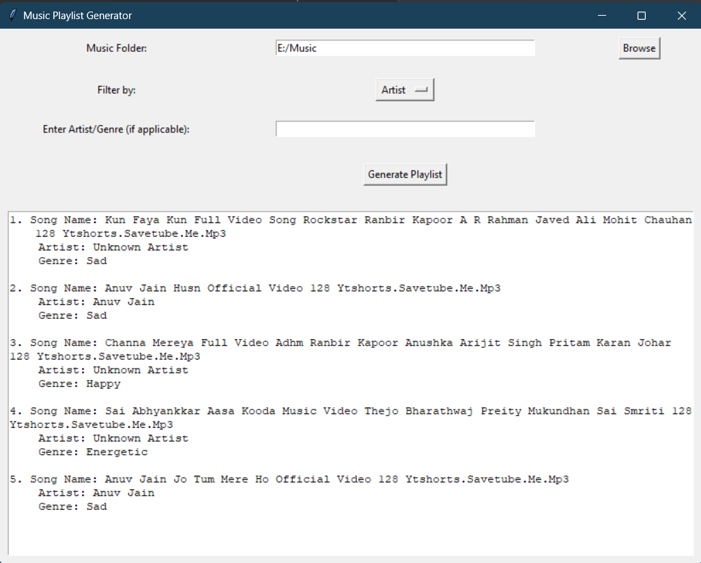

# Music Playlist Generator

## Overview
The Music Playlist Generator is a simple Python application that allows users to create randomized playlists from MP3 files located in a selected folder. Users can filter songs by artist or genre, making it easier to generate customized playlists.

## Features
- Extracts metadata (artist and genre) from MP3 files.
- Allows filtering of songs by artist or genre.
- Randomizes the order of songs in the generated playlist.
- Displays the playlist in a user-friendly interface with song details.

## Requirements
- Python 3.x
- Tkinter (comes pre-installed with Python)
- Mutagen library for handling audio metadata. Install it using:
  ```bash
  pip install mutagen
  ```

## Usage
1. Clone this repository or download the script.
2. Run the script using Python:
   ```bash
   python your_script_name.py
   ```
3. In the application:
   - Click on "Browse" to select a folder containing MP3 files.
   - Choose a filter option (None, Artist, Genre) from the dropdown menu.
   - Enter the corresponding filter value (if applicable).
   - Click on "Generate Playlist" to create and display the playlist.

## Example
Once a folder is selected and a filter is applied, the generated playlist will show songs in the following format:
```
1. Song Name: Song Title
   Artist: Artist Name
   Genre: Genre Name

2. Song Name: Another Song Title
   Artist: Another Artist
   Genre: Another Genre
```
## Screen Shots



## Acknowledgments
- Thanks to the open-source community for providing the libraries used in this project.
```

