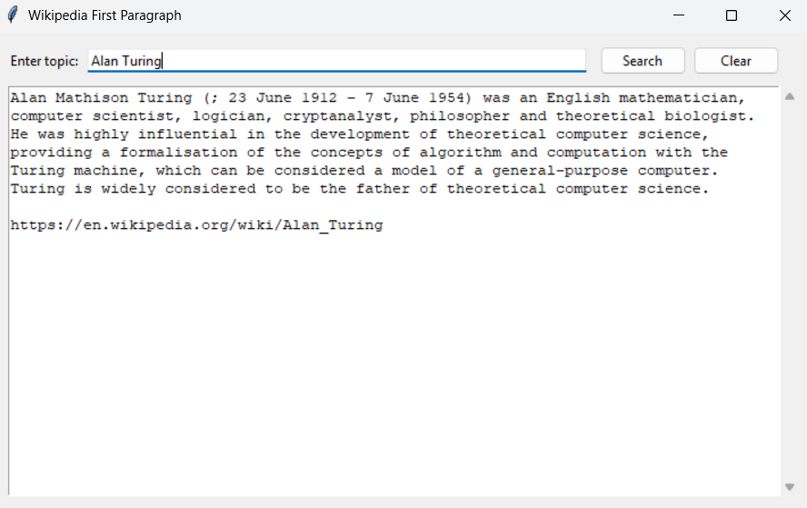

# Wikipedia First Paragraph Desktop App
 
A lightweight Tkinter GUI that lets you type any topic and instantly shows the first-paragraph summary from Wikipedia. 
 
## Description
 
This Python app wraps the `wikipedia` library in a tiny desktop UI. It resolves fuzzy queries (e.g., “A.I.” → “AI”), handles disambiguation (e.g., “Mercury”), supports Unicode titles (e.g., “Søren Kierkegaard”), and displays the first paragraph of the matched page.
 
## Features
 
- Simple desktop GUI (Tkinter)  
- First-paragraph summary from Wikipedia  
- Robust topic resolution using search + redirect  
- Disambiguation guidance (lists top options)  
- Unicode/diacritics friendly  
- Clean shutdown on **Ctrl+C** or window close  
- Under 100 lines of Python
 
## Prerequisites
 
- Python 3.8 or higher  
- `wikipedia` library  
- Tkinter (bundled with most Python distributions)
 
## Installation
 
1. Clone the repository or download the script.
2. Install the dependency:
```bash
pip install wikipedia
```

or 
 
```bash
pip install -r requirements.txt
```
## Usage
 
### Run the App
 
From a **plain terminal** (not an IDE debugger), run:
```bash
python wikipedia_summary_fetcher.py
```
 
Then:
1. Type a topic (e.g., `Alan Turing`, `Python`, `A.I.`, `Søren Kierkegaard`).
2. Press **Enter** or click **Search**.
3. View the first-paragraph summary in the text area.
4. Close via the window button **or** press **Ctrl+C** in the terminal.
 
### Keyboard Shortcuts
 
- **Enter** → Search  
- **Ctrl+C (terminal)** → Exit the app
 
## Sample Output (Image)
 

 
## Sample Output (Text)
 
```
Topic: Alan Turing
--------------------------------------------------------------------------------
Alan Mathison Turing was an English mathematician, computer scientist, logician,
cryptanalyst, philosopher, and theoretical biologist. ...
```
 
## Command-line Tips
 
- If Ctrl+C doesn’t stop the app, ensure you’re running it from a **terminal** rather than an IDE.  
- The app uses a SIGINT handler and a Tk “heartbeat” to shut down cleanly when Ctrl+C is received.  
- On Windows, some shells buffer signals—try `py wikipedia_summary_fetcher.py` or use PowerShell/CMD directly.
 
## Tests (Search/Resolve Focus)
 
This project includes pytest cases that mock Wikipedia I/O and stress tricky search inputs (acronyms, Unicode, special characters, disambiguation).
 
### What’s Covered
 
- Exact matches: `Alan Turing`  
- Acronyms/redirects: `A.I.`, `USA`, `NYC`  
- Disambiguation: `Mercury`, `Java`, `Apple`  
- Unicode & transliteration: `Søren Kierkegaard`, `Gödel`, `pi/π`  
- Special characters: `E=mc^2`, `C++`  
- No hits / nonsense: `asdfghjklqwerty`
 
## Technical Details
 
- GUI: Tkinter (`ttk` widgets)  
- Data: `wikipedia` Python library  
- Strategy: `wikipedia.search()` to resolve the best title, then `wikipedia.summary(..., redirect=True)` for the first paragraph  
- Robust exit: SIGINT handler flips a flag; a Tk `after()` heartbeat triggers a safe shutdown; window close binds to the same exit logic
 
## Error Handling
 
- **Disambiguation** → Shows top options to refine the query  
- **Page not found** → User-friendly “No page found” message  
- **Unexpected errors** → Printed message in the output area
 
## Limitations
 
- Requires network access to Wikipedia  
- Some very broad queries will return disambiguation lists  
- Wikipedia content may vary by language; default is English
 
## Contributing
 
Contributions are welcome! You can:  
- Report issues  
- Improve UI/UX (dark mode, theming, accessibility)  
- Add localization and more tests
 
## License
 
Open source under the repository’s license (e.g., MIT). Please check `LICENSE` for details.
